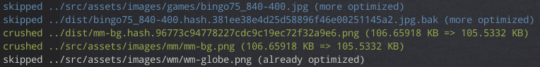

# imagemin-merlin (aka Merlin)

Merlin is an extension of [imagemin](https://www.npmjs.com/package/imagemin) that makes it _super-easy_ to automatically, efficiently compress GIF, JPG and PNG graphics.

It’s “super-easy” for two reasons:

1. Setup is simple and there’s no confusion around what needs to be done how, where, when and why. Install, run, done – forever.

2. Compression happens _losslessly_ through standard settings. That’s explicitly regarded a benefit here not to worry about overly aggressive default optimization. (Further micro-optimization may happen separately.)

## Installation and use

### 1) Install

Install Merlin in respective Node project:

```bash
npm i -D @sum.cumo/imagemin-merlin
```

### 2a) Set up manual optimization

For manual use, add the following in the `scripts` section of the project’s package.json:

```json
{
  "scripts":{
    "imagemin": "imagemin-merlin"
  }
}
```

To ensure that _all_ GIFs, JPGs and PNGs have at least been optimized once, it’s recommended to run Merlin manually right after installation: `npm run imagemin`.

There’s a `--folder` option that allows to set a particular folder for compression, different from the project root. For example, `npm run imagemin -- --folder=static`. The `node_modules` folder is ignored by default.

`--dry` is an optional parameter to run Merlin in “dry mode.” All changed files can then be inspected under `/tmp/imagemin-merlin`.

`-ignore` is an optional parameter to let Merlin ignore the specified paths. Multiple paths has to be seperated by a comma.

### 2b) Set up automatic optimization

For automated use Merlin should then be triggered through [Git hooks](https://git-scm.com/book/en/v2/Customizing-Git-Git-Hooks) or a related tool like [Husky](https://github.com/typicode/husky) (`npm i -D husky`), for example on `pre-commit`. For that, using Husky as an example, the following may be added to package.json (main level):

```json
"husky": {
  "hooks": {
    "pre-commit": "npm run imagemin -- --staged"
  }
},
```

The `--staged` parameter triggers a mode that watches GIF, JPG and PNG files in `git diff` and only compresses those files – that approach makes Merlin be quite efficient in operation. (Note that the `folder` parameter doesn’t work in `staged` mode.)

## How does the output look like?



* Green: The graphic has been optimized.
* White: The graphic has not been changed.
* Blue: The graphic had already been compressed further than the new result, and was therefore skipped.

## How does Merlin work?

Merlin is a Node script that puts a little [wrapper](bin/imagemin-merlin.js) around [imagemin-cli](https://www.npmjs.com/package/imagemin-cli) and the three losslessly compressing sub-packages [imagemin-gifsicle](https://www.npmjs.com/package/imagemin-gifsicle), [imagemin-optipng](https://www.npmjs.com/package/imagemin-optipng) and [imagemin-jpegtran](https://www.npmjs.com/package/imagemin-jpegtran).

Unless manual optimization over the project or subfolders is triggered, automated compression works through Git hooks that monitor whether a given change list includes image files. If it does, only those images are compressed where there is an improvement, so to prevent regressions and to be able to actually feed back the improved images to the underlying repository.

Through this approach, though still glossed over here, Merlin makes up for what’s missing or complicated in imagemin and related packages, namely easy, riskless, automated, resource-friendly “on site” optimization.

### Why use Merlin?

(This is just a paraphrased remainder of earlier documentation, just left for the moment in case it makes anything more clear ☺️)

You _can_ use Merlin if you need a simple, automatable, robust solution to compress images and to keep the compressed result in your repository (instead of only in the production environment).

That last piece is useful since Merlin compresses losslessly, so that there’s no risk that images suffer from quality issues after processing through Merlin. This kind of defensive base compression makes it rather obvious to also want to feed back compressed graphics into one’s source repository – which is why Merlin works the way it does

## What does Merlin _not_ do?

Merlin is no substitute for image fine-tuning and micro-optimization. That is really difficult to do in an automated fashion, because that type of compression requires weighing quality and performance, which is [context-dependent](https://meiert.com/en/blog/understanding-image-compression/). In its most extreme form, when maximum quality at maximum performance is required from each graphic, micro-optimization is even hard to do manually.

The point is: Micro-optimization still needs to be taken care of through complementary means, whether manually or through other tools (well including other packages from the [imagemin family](https://github.com/imagemin)). Merlin simply solves the problem that images are checked in or go live that are not compressed _at all_.

## What’s next?

Some new features we’re working on or think about:

* Give the option to configure the underlying imagemin plugins (somewhat prepared for but not completed yet).
* Observe .gitignore files when Merlin doesn’t run as `--staged`.
* Support project structures in which the project’s .git folder is not at the same level as its package.json – at the moment, automatic mode doesn’t work in these cases.

Thoughts, suggestions, fixes? Please file an [issue](https://github.com/sumcumo/imagemin-merlin/issues/new) or send a pull request – thank you!

## License

Copyright 2019 [sum.cumo GmbH](https://www.sumcumo.com/)

Licensed under the Apache License, Version 2.0 (the “License”); you may not use this file except in compliance with the License. You may obtain a copy of the License at

    http://www.apache.org/licenses/LICENSE-2.0

Unless required by applicable law or agreed to in writing, software distributed under the License is distributed on an “AS IS” BASIS, WITHOUT WARRANTIES OR CONDITIONS OF ANY KIND, either express or implied. See the License for the specific language governing permissions and limitations under the License.

----

[Learn more about sum.cumo](https://www.sumcumo.com/en) and [work on open source projects](https://www.sumcumo.com/jobs), too!
